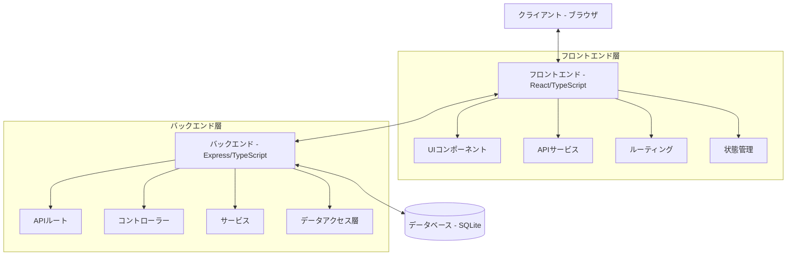
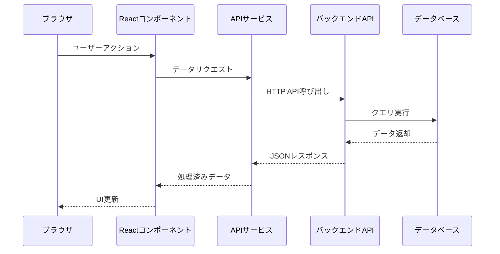

# アーキテクチャ概要

## システムアーキテクチャ

tsundo-cleanerは、クライアント・サーバーモデルに基づいた現代的なWebアプリケーションアーキテクチャを採用しています。以下の図は、システム全体の構成を示しています。



このアーキテクチャは、以下の主要な特徴を持っています：

1. **フロントエンドとバックエンドの明確な分離**：それぞれが独立して開発・デプロイ可能
2. **RESTful API**：標準的なHTTPメソッドとエンドポイントを介した通信
3. **レイヤードアーキテクチャ**：関心事の分離による保守性・拡張性の向上
4. **型安全性**：TypeScriptによる静的型チェック

## ディレクトリ構造

プロジェクトは、フロントエンドとバックエンドで明確に分離されています。

### バックエンド構造

```
backend/
├── src/
│   ├── index.ts            # エントリーポイント
│   ├── config/             # 設定
│   │   └── database.ts     # データベース接続設定
│   ├── controllers/        # APIコントローラー
│   │   ├── bookController.ts
│   │   ├── similarityController.ts
│   │   └── statisticsController.ts
│   ├── models/             # データモデル
│   │   └── Book.ts
│   ├── routes/             # APIルート定義
│   │   └── api.ts
│   ├── services/           # ビジネスロジック
│   │   ├── bookService.ts
│   │   ├── recommendationService.ts
│   │   ├── similarityService.ts
│   │   └── statisticsService.ts
│   └── utils/              # ユーティリティ関数
├── package.json
└── tsconfig.json
```

### フロントエンド構造

```
frontend/
├── src/
│   ├── main.tsx           # エントリーポイント
│   ├── App.tsx            # ルートコンポーネント
│   ├── components/        # 再利用可能なコンポーネント
│   │   ├── BookCard.tsx
│   │   ├── Layout.tsx
│   │   ├── SimilarBooks.tsx
│   │   └── WeeklyRecommendation.tsx
│   ├── pages/             # ページコンポーネント
│   │   ├── HomePage.tsx
│   │   ├── SearchPage.tsx
│   │   └── StatsPage.tsx
│   ├── services/          # APIクライアント
│   │   ├── api.ts
│   │   ├── bookService.ts
│   │   └── statisticsService.ts
│   ├── types/             # 型定義
│   │   └── Book.ts
│   └── utils/             # ユーティリティ関数
├── index.html
├── package.json
├── tsconfig.json
└── vite.config.ts
```

## レイヤー構造

### フロントエンドレイヤー

フロントエンドは、以下のレイヤーで構成されています：

1. **ページ（Pages）**：アプリケーションの各ページを表すコンポーネント
   - ユーザーインターフェイスの最上位レベル
   - ルーティングの対象となるコンポーネント

2. **コンポーネント（Components）**：再利用可能なUI要素
   - ページ内で使用される独立したUI部品
   - 特定のレンダリングとインタラクションの責任を持つ

3. **サービス（Services）**：APIとの通信とデータ処理
   - バックエンドAPIへのリクエスト
   - レスポンスデータの加工と変換

4. **型（Types）**：データの型定義
   - フロントエンド全体で一貫したデータ構造の保証
   - 型安全性の確保

### バックエンドレイヤー

バックエンドは、以下のレイヤーで構成されています：

1. **ルート（Routes）**：APIエンドポイントの定義
   - HTTPメソッドとURLパスのマッピング
   - リクエストの適切なコントローラーへの転送

2. **コントローラー（Controllers）**：リクエスト処理とレスポンス生成
   - リクエストパラメータの検証
   - 適切なサービスの呼び出し
   - レスポンスの構築と返却

3. **サービス（Services）**：ビジネスロジック
   - アプリケーションの中核機能を実装
   - 複数のサービス間の連携を管理

4. **データアクセス層（Data Access Layer）**：データの永続化と取得
   - データベースとの接続管理
   - SQLクエリの実行
   - エンティティの変換

## データフロー

tsundo-cleaner内のデータフローは、リクエスト・レスポンスサイクルに従っています。

### リクエストフロー（フロントエンドからバックエンドへ）



1. ユーザーがUI操作を実行（例：「今週のおすすめ」ボタンをクリック）
2. Reactコンポーネントが関連するAPIサービスを呼び出し
3. APIサービスがHTTPリクエストを生成し、バックエンドAPIに送信
4. バックエンドのルーターが適切なコントローラーにリクエストを転送
5. コントローラーがリクエストパラメータを検証し、サービスを呼び出し
6. サービスがビジネスロジックを実行（例：推薦アルゴリズム）
7. 必要に応じてデータベースからデータを取得
8. 処理結果がコントローラーに返され、レスポンスが生成
9. JSONレスポンスがフロントエンドに返送
10. APIサービスがデータを処理し、コンポーネントに提供
11. コンポーネントがUIを更新し、ユーザーに結果を表示

### データ変換フロー

特筆すべき点として、バックエンドとフロントエンド間でのデータモデル変換があります：

```mermaid
graph LR
    BookDB[BookDB</br>データベースモデル</br>exist_in_Sophia: 'Yes'/'No'] 
    --> |convertToAppModel| 
    Book[Book</br>アプリケーションモデル</br>exist_in_Sophia: boolean]
    
    Book --> |JSON化| JsonBook[JSONデータ]
    JsonBook --> |デシリアライズ| FrontendBook[フロントエンド</br>Bookインターフェース]
```

1. データベース内では、真偽値が`'Yes'`/`'No'`の文字列として格納
2. バックエンドサービスで`BookDB`から`Book`オブジェクトに変換（文字列→boolean）
3. 変換された`Book`オブジェクトがJSONとしてクライアントに送信
4. フロントエンドでJSONデータがTypeScriptの`Book`インターフェースとして型付け

この変換プロセスにより、データベースの制約とフロントエンドのプログラミングモデルの違いを吸収し、それぞれの層で最適な形式でデータを扱うことができます。

## アーキテクチャ上の特徴

### スケーラビリティ

- **水平分割**：フロントエンドとバックエンドの分離により、それぞれを独立してスケールアウト可能
- **コンポーネント設計**：再利用可能なコンポーネントにより、UIの拡張性を向上

### 保守性

- **関心の分離**：各レイヤーが明確な責任を持ち、変更影響範囲を限定
- **TypeScript**：静的型チェックによるエラー検出とコード品質の向上
- **モジュール性**：独立したモジュールによる並行開発とテストの容易さ

### パフォーマンス

- **バッチ処理**：類似度計算における効率的なバッチ処理
- **SQLiteの活用**：軽量で高速なデータベースエンジン
- **Vite**：高速な開発サーバーとバンドリング

次のセクションでは、バックエンド技術について詳細に解説します。
