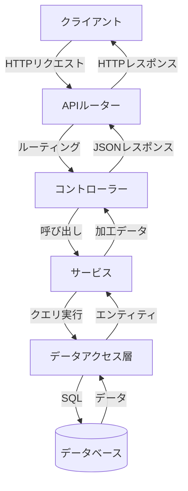

# バックエンド技術解説

## バックエンド概要

tsundo-cleanerのバックエンドは、Node.js上でExpressフレームワークを使用し、TypeScriptで実装されています。これにより、型安全性とモジュール性に優れた堅牢なAPIサーバーを実現しています。

以下では、バックエンドで使用されている主要技術とその実装方法について解説します。

## 使用技術とライブラリ

### 1. Express

Express.jsは、Node.js向けの軽量でフレキシブルなWebアプリケーションフレームワークです。tsundo-cleanerでは、RESTful APIの構築にExpressを使用しています。

```typescript
// index.ts - Expressアプリケーションの設定
import express, { Express } from 'express';
import cors from 'cors';
import apiRoutes from './routes/api';

// 環境変数の設定
const PORT = process.env.PORT || 3001;

// Expressアプリケーションの初期化
const app: Express = express();

// ミドルウェアの設定
app.use(cors()); // CORS設定
app.use(express.json()); // JSONボディパーサー

// ルートの設定
app.use('/api', apiRoutes);

// サーバー起動
app.listen(PORT, () => {
  console.log(`サーバーがポート ${PORT} で起動しました`);
});
```

#### 主要機能
- **ミドルウェア処理**: リクエスト処理の中間層として機能
- **ルーティング**: HTTPリクエストをコントローラーに転送
- **エラーハンドリング**: 統一的なエラー処理の仕組み

### 2. TypeScript

TypeScriptは、JavaScriptに静的型付けを追加した言語です。tsundo-cleanerでは、型安全性と開発効率の向上のためにTypeScriptを採用しています。

```typescript
// Book.ts - TypeScriptを活用したインターフェース定義
export interface BookDB {
  bookmeter_url: string;       // 読書メーターURL (プライマリキー)
  isbn_or_asin: string;        // ISBN/ASIN
  book_title: string;          // 書籍タイトル
  author: string;              // 著者
  publisher: string;           // 出版社
  published_date: string;      // 出版日
  exist_in_Sophia: string;     // 上智大学にあるか ('Yes'/'No')
  exist_in_UTokyo: string;     // 東京大学にあるか ('Yes'/'No')
  sophia_opac?: string;        // 上智OPACリンク
  utokyo_opac?: string;        // 東大OPACリンク
  sophia_mathlib_opac?: string; // 上智数学図書館OPACリンク
  description?: string;        // 書籍の説明
}
```

#### TypeScriptの利点
- **型安全性**: コンパイル時にエラーを検出
- **インテリセンス**: コード補完と自動ドキュメント化
- **コードの可読性**: 明示的な型定義による意図の明確化
- **リファクタリングの容易さ**: 型システムによる変更の影響範囲の把握

### 3. SQLite

SQLiteは、サーバーレス、ゼロコンフィギュレーションのSQLデータベースエンジンです。tsundo-cleanerでは、軽量で設定の少ないデータベースとしてSQLiteを使用しています。

```typescript
// database.ts - SQLiteデータベースの設定
import path from 'path';
import sqlite3 from 'sqlite3';
import * as fs from 'fs';
import { dirname } from 'path';

// データベースファイルへのパス設定
const DEFAULT_DB_PATH = path.join(process.cwd(), 'data', 'books.sqlite');
const SQLITE_DB_PATH = process.env.SQLITE_DB_PATH || DEFAULT_DB_PATH;

// シングルトンとして保持するコネクションプール
let dbPool: sqlite3.Database | null = null;

/**
 * SQLiteデータベースコネクションプールを取得する
 */
export const getDatabase = (): sqlite3.Database => {
  if (dbPool === null) {
    dbPool = new sqlite3.Database(SQLITE_DB_PATH, (err) => {
      if (err) {
        console.error('SQLiteデータベース接続エラー:', err.message);
        throw err;
      }
      console.log('SQLiteデータベースに接続しました:', SQLITE_DB_PATH);
    });
  }
  return dbPool;
};

/**
 * Promise化されたクエリ実行関数
 */
export const query = async <T>(
  db: sqlite3.Database,
  sql: string,
  params: any[] = []
): Promise<T[]> => {
  return new Promise((resolve, reject) => {
    db.all(sql, params, (err, rows) => {
      if (err) {
        reject(err);
        return;
      }
      resolve(rows as T[]);
    });
  });
};
```

#### SQLiteの特徴
- **ファイルベース**: 単一のファイルとしてデータベースを保存
- **サーバーレス**: 別途サーバープロセスが不要
- **軽量**: メモリ使用量が少なく、起動が高速
- **トランザクション**: ACID準拠の完全なトランザクションサポート

### 4. Natural（自然言語処理）

naturalは、Node.js向けの自然言語処理ライブラリです。tsundo-cleanerでは、TF-IDF（Term Frequency-Inverse Document Frequency）アルゴリズムを実装するためにこのライブラリを使用しています。

```typescript
// similarityService.ts - TF-IDFを使用した類似度計算
import { TfIdf } from 'natural';
import { Book, BookDB } from '../models/Book';

/**
 * 説明文を使って類似書籍を見つける
 */
private findSimilarByDescription(
  referenceBook: Book,
  targetBooks: Book[],
  limit: number
): Book[] {
  // 説明文のない書籍をフィルタリング
  const validTargetBooks = targetBooks.filter(book => 
    book.description && book.description.trim() !== ''
  );
  
  const tfidf = new TfIdf();

  // まず全ての説明文をTF-IDFに追加（基準書籍を最初に）
  tfidf.addDocument(referenceBook.description || '');
  validTargetBooks.forEach(book => {
    tfidf.addDocument(book.description || '');
  });

  // 類似度スコアの計算をバッチ処理で行う
  const terms = this.extractKeyTerms(referenceBook.description || '');
  const similarityScores = validTargetBooks.map((book, index) => {
    const docIndex = index + 1; // +1は基準書籍がインデックス0だから
    
    // 重要な単語のみを使って類似度を計算し、計算量を削減
    let score = 0;
    terms.forEach(term => {
      const similarity = tfidf.tfidf(term, docIndex);
      score += similarity;
    });
    
    return { book, score };
  });

  // スコアの高い順にソートして上位limit件を返す
  return similarityScores
    .sort((a, b) => b.score - a.score)
    .slice(0, limit)
    .map(item => item.book);
}
```

#### NaturalライブラリとTF-IDFの活用
- **文書類似度計算**: 書籍の説明文から類似度を算出
- **重要単語抽出**: 文書中の重要な単語を特定
- **効率的な実装**: バッチ処理による計算の最適化

## アーキテクチャパターン

### レイヤードアーキテクチャ

tsundo-cleanerのバックエンドは、責任範囲を明確に分割したレイヤードアーキテクチャパターンを採用しています。



#### 各レイヤーの役割

1. **ルーターレイヤー**: URLパスとHTTPメソッドをコントローラーのメソッドにマッピング

```typescript
// api.ts - ルーター定義
import express, { Router } from 'express';
import { BookController } from '../controllers/bookController';
import { SimilarityController } from '../controllers/similarityController';
import { StatisticsController } from '../controllers/statisticsController';

const router: Router = express.Router();

// コントローラーのインスタンス化
const bookController = new BookController();
const similarityController = new SimilarityController();
const statisticsController = new StatisticsController();

// 書籍関連のルート
router.get('/books', bookController.getAllBooks);
router.get('/books/search', bookController.searchBooks);
router.get('/book', bookController.getBookByUrl);

// 推薦関連のルート
router.get('/books/weekly', bookController.getWeeklyRecommendation);
router.get('/books/recommend-by-genre', bookController.getRecommendationByGenre);

// 類似書籍関連のルート
router.get('/books/similar', similarityController.getSimilarBooks);

// 統計情報関連のルート
router.get('/stats/publishers', statisticsController.getPublisherDistribution);
router.get('/stats/authors', statisticsController.getAuthorDistribution);
router.get('/stats/years', statisticsController.getYearDistribution);
router.get('/stats/libraries', statisticsController.getLibraryDistribution);

export default router;
```

2. **コントローラーレイヤー**: リクエスト処理とレスポンス生成を担当

```typescript
// bookController.ts - コントローラー実装例
import { Request, Response } from 'express';
import { BookService } from '../services/bookService';
import { RecommendationService } from '../services/recommendationService';

export class BookController {
  private bookService: BookService;
  private recommendationService: RecommendationService;

  constructor() {
    this.bookService = new BookService();
    this.recommendationService = new RecommendationService();
  }

  /**
   * 週間おすすめ本を取得するエンドポイント
   */
  getWeeklyRecommendation = async (req: Request, res: Response): Promise<void> => {
    try {
      const book = await this.recommendationService.getWeeklyRecommendation();
      res.json(book);
    } catch (err: any) {
      res.status(500).json({ error: err.message });
    }
  };

  // 他のエンドポイント実装...
}
```

3. **サービスレイヤー**: ビジネスロジックを実装

```typescript
// recommendationService.ts - サービス実装例（一部抜粋）
import { Book, BookDB, BookType } from '../models/Book';
import { getDatabase, query } from '../config/database';

export class RecommendationService {
  /**
   * 週間おすすめ本を取得
   */
  async getWeeklyRecommendation(): Promise<Book> {
    const db = getDatabase();
    try {
      // ランダム性を持たせるために、現在の週番号を使用
      const now = new Date();
      const weekNumber = Math.floor((now.getTime() / (7 * 24 * 60 * 60 * 1000)));
      
      // クエリを実行: UTokyoにある本 → Sophiaにある本 → どちらにもない本の優先順位
      let books = await query<BookDB>(
        db,
        `SELECT * FROM wish 
         WHERE exist_in_UTokyo = 'Yes'
         ORDER BY book_title`
      );
      
      // UTokyoの本がなければSophiaの本を検索
      if (books.length === 0) {
        books = await query<BookDB>(
          db,
          `SELECT * FROM wish 
           WHERE exist_in_Sophia = 'Yes'
           ORDER BY book_title`
        );
      }
      
      // どちらもなければ全ての本から選択
      if (books.length === 0) {
        books = await query<BookDB>(
          db,
          `SELECT * FROM wish 
           ORDER BY book_title`
        );
      }
      
      // 本がない場合はエラー
      if (books.length === 0) {
        throw new Error('推薦する本が見つかりませんでした');
      }
      
      // 週番号を使ってランダムに1冊選択
      const randomIndex = weekNumber % books.length;
      
      // DB形式からアプリケーション形式に変換
      return this.convertToAppModel(books[randomIndex]);
    } catch (err: any) {
      console.error('getWeeklyRecommendationでエラーが発生しました:', err.message);
      throw err;
    }
  }

  /**
   * DB形式の書籍データをアプリケーション形式に変換する
   */
  private convertToAppModel(dbBook: BookDB): Book {
    return {
      ...dbBook,
      exist_in_Sophia: dbBook.exist_in_Sophia === 'Yes',
      exist_in_UTokyo: dbBook.exist_in_UTokyo === 'Yes'
    };
  }
}
```

4. **データアクセスレイヤー**: データベースとのやり取りを抽象化

このアプリケーションでは、データアクセスロジックをサービスレイヤー内に統合していますが、一般的なベストプラクティスとしては、こうしたロジックを専用のリポジトリやDAOクラスに分割することが推奨されます。

## RESTful API設計

tsundo-cleanerは、標準的なRESTful API設計原則に従っています。

### APIエンドポイント

| エンドポイント | メソッド | 説明 | クエリパラメータ |
|--------------|--------|------|-------------|
| /api/books | GET | 全ての書籍を取得 | type: 'wish'/'stacked' |
| /api/books/search | GET | 書籍を検索 | query: 検索キーワード, type: 'wish'/'stacked' |
| /api/book | GET | URLで指定された書籍を取得 | url: 書籍URL |
| /api/books/weekly | GET | 今週のおすすめ本を取得 | なし |
| /api/books/similar | GET | 類似書籍を取得 | url: 書籍URL, type: 'wish'/'stacked', limit: 取得件数 |
| /api/stats/publishers | GET | 出版社別統計を取得 | type: 'wish'/'stacked' |
| /api/stats/authors | GET | 著者別統計を取得 | type: 'wish'/'stacked' |
| /api/stats/years | GET | 出版年別統計を取得 | type: 'wish'/'stacked' |
| /api/stats/libraries | GET | 図書館所蔵状況の統計を取得 | type: 'wish'/'stacked' |

### レスポンス形式

すべてのAPIエンドポイントは、一貫したJSON形式でレスポンスを返します。

```json
// 成功時のレスポンス例
{
  "bookmeter_url": "https://bookmeter.com/books/12345678",
  "isbn_or_asin": "9784123456789",
  "book_title": "プログラミング入門",
  "author": "山田太郎",
  "publisher": "技術書出版",
  "published_date": "2023-01-15",
  "exist_in_Sophia": true,
  "exist_in_UTokyo": false,
  "sophia_opac": "https://sophia-opac.example.com/123456",
  "description": "初心者向けプログラミング入門書..."
}

// エラー時のレスポンス例
{
  "error": "指定された書籍が見つかりませんでした"
}
```

### エラーハンドリング

各APIエンドポイントでは、try-catchブロックを使用して例外を捕捉し、適切なHTTPステータスコードとエラーメッセージを返します。

```typescript
try {
  // 処理ロジック
  res.json(result);
} catch (err: any) {
  console.error('エラーが発生しました:', err.message);
  res.status(500).json({ error: err.message });
}
```

## バックエンドの特徴と利点

### 型安全性

TypeScriptの静的型システムにより、コンパイル時に多くのエラーを検出できます。特にデータモデルの定義やAPI間のデータ受け渡しにおいて、型の不一致によるバグを未然に防止します。

### モジュール性

レイヤードアーキテクチャの採用により、各コンポーネントは明確な責任範囲を持ち、独立して開発・テストできます。これにより、コードの保守性と再利用性が向上します。

### スケーラビリティ

Express.jsの軽量性とNode.jsの非同期処理モデルにより、効率的なリソース利用とスケーラビリティを実現しています。また、サービスレイヤーの抽象化により、将来的なデータベース変更や機能拡張への対応が容易になります。

### 開発効率

TypeScriptのインテリセンス（コード補完）とExpressの簡潔なAPI設計により、開発効率が向上します。また、SQLiteの設定レス運用により、開発環境のセットアップが容易になります。

次のセクションでは、フロントエンド技術について詳細に解説します。
