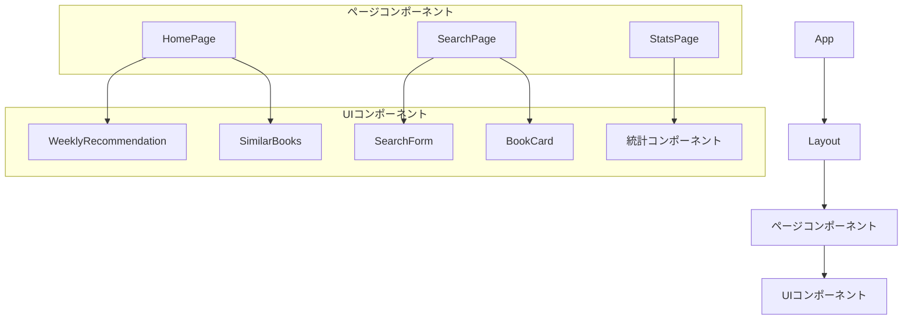

# フロントエンド技術解説

## フロントエンド概要

tsundo-cleanerのフロントエンドは、React、TypeScript、Viteを中心に構築され、モダンなUIコンポーネント設計と効率的な状態管理を実現しています。このセクションでは、フロントエンドで使用している主要技術とその実装方法について解説します。

## 使用技術とライブラリ

### 1. React

Reactは、Facebookが開発したUIライブラリで、コンポーネントベースのアプローチでユーザーインターフェースを構築します。tsundo-cleanerでは、React 19を使用し、機能的で再利用可能なコンポーネントを実装しています。

```tsx
// WeeklyRecommendation.tsx - Reactコンポーネントの例
import React, { useState, useEffect } from 'react';
import styled from 'styled-components';
import { Book } from '../types/Book';
import { bookService } from '../services/bookService';

const WeeklyRecommendation: React.FC = () => {
  const [weeklyBook, setWeeklyBook] = useState<Book | null>(null);
  const [loading, setLoading] = useState<boolean>(true);
  const [error, setError] = useState<string | null>(null);

  useEffect(() => {
    const fetchWeeklyBook = async () => {
      try {
        setLoading(true);
        const book = await bookService.getWeeklyRecommendation();
        setWeeklyBook(book);
        setError(null);
      } catch (err) {
        console.error('週間おすすめ本の取得に失敗しました', err);
        setError('週間おすすめ本の取得に失敗しました。後ほど再度お試しください。');
      } finally {
        setLoading(false);
      }
    };

    fetchWeeklyBook();
  }, []);

  if (loading) {
    return <LoadingIndicator>読み込み中...</LoadingIndicator>;
  }

  if (error) {
    return <ErrorMessage>{error}</ErrorMessage>;
  }

  if (!weeklyBook) {
    return <EmptyMessage>今週のおすすめ本はありません</EmptyMessage>;
  }

  return (
    <BookCard>
      <BookTitle>{weeklyBook.book_title}</BookTitle>
      <BookAuthor>著者: {weeklyBook.author}</BookAuthor>
      <BookPublisher>出版社: {weeklyBook.publisher}</BookPublisher>
      <LibraryStatus>
        東京大学蔵書: {weeklyBook.exist_in_UTokyo ? 'あり' : 'なし'}
        {weeklyBook.exist_in_UTokyo && weeklyBook.utokyo_opac && (
          <LibraryLink href={weeklyBook.utokyo_opac} target="_blank">
            OPACで確認
          </LibraryLink>
        )}
      </LibraryStatus>
      <LibraryStatus>
        上智大学蔵書: {weeklyBook.exist_in_Sophia ? 'あり' : 'なし'}
        {weeklyBook.exist_in_Sophia && weeklyBook.sophia_opac && (
          <LibraryLink href={weeklyBook.sophia_opac} target="_blank">
            OPACで確認
          </LibraryLink>
        )}
      </LibraryStatus>
      {weeklyBook.description && (
        <BookDescription>{weeklyBook.description}</BookDescription>
      )}
    </BookCard>
  );
};

// スタイル定義（styled-components）
const BookCard = styled.div`
  border: 1px solid #e0e0e0;
  border-radius: 8px;
  padding: 24px;
  box-shadow: 0 2px 4px rgba(0, 0, 0, 0.1);
  background-color: #fff;
`;

const BookTitle = styled.h2`
  font-size: 24px;
  font-weight: 700;
  margin-bottom: 8px;
  color: #333;
`;

// 他のスタイルコンポーネント定義...

export default WeeklyRecommendation;
```

#### Reactの主要な特徴

- **コンポーネントベース**: UIを独立した再利用可能なパーツに分割
- **単方向データフロー**: 予測可能な状態管理
- **仮想DOM**: 効率的なUIレンダリング
- **宣言的UI**: 「どのように」ではなく「何を」表示するかに焦点
- **Hooks**: 関数コンポーネントで状態や副作用を管理

### 2. TypeScript

TypeScriptはJavaScriptのスーパーセットで、静的型付けを提供します。tsundo-cleanerでは、型安全性とコード品質向上のためにTypeScriptを使用しています。

```tsx
// Book.ts - TypeScriptインターフェース定義
export interface Book {
  bookmeter_url: string;       // 読書メーターURL (プライマリキー)
  isbn_or_asin: string;        // ISBN/ASIN
  book_title: string;          // 書籍タイトル
  author: string;              // 著者
  publisher: string;           // 出版社
  published_date: string;      // 出版日
  exist_in_Sophia: boolean;    // 上智大学にあるか
  exist_in_UTokyo: boolean;    // 東京大学にあるか
  sophia_opac?: string;        // 上智OPACリンク
  utokyo_opac?: string;        // 東大OPACリンク
  sophia_mathlib_opac?: string; // 上智数学図書館OPACリンク
  description?: string;        // 書籍の説明
}

// bookService.ts - TypeScriptを活用した型安全なAPIサービス
import apiClient from './api';
import { Book } from '../types/Book';

export const bookService = {
  /**
   * 全ての書籍を取得
   */
  async getAllBooks(type: 'wish' | 'stacked' = 'wish'): Promise<Book[]> {
    const response = await apiClient.get<Book[]>('/books', {
      params: { type }
    });
    return response.data;
  },

  /**
   * 書籍検索
   */
  async searchBooks(query: string, type: 'wish' | 'stacked' = 'wish'): Promise<Book[]> {
    const response = await apiClient.get<Book[]>('/books/search', {
      params: { query, type }
    });
    return response.data;
  },

  /**
   * 週間おすすめ本を取得
   */
  async getWeeklyRecommendation(): Promise<Book> {
    const response = await apiClient.get<Book>('/books/weekly');
    return response.data;
  }
  
  // 他のメソッド...
};
```

#### TypeScriptの利点

- **静的型チェック**: コンパイル時にエラーを検出
- **コード補完**: IDE上でのインテリセンスサポート
- **ドキュメンテーション**: 型定義による自動ドキュメント化
- **リファクタリングのサポート**: コードの安全な変更
- **APIコントラクト**: バックエンドとフロントエンド間の整合性確保

### 3. Vite

Viteは、モダンなフロントエンド開発ツールで、高速な開発サーバーとビルドツールを提供します。tsundo-cleanerでは、Viteを使用して開発効率とビルドパフォーマンスを向上させています。

```javascript
// vite.config.ts - Vite設定ファイル
import { defineConfig } from 'vite';
import react from '@vitejs/plugin-react';

export default defineConfig({
  plugins: [react()],
  server: {
    port: 3000,
    open: true,
  },
  build: {
    outDir: 'dist',
    sourcemap: true,
  },
});
```

#### Viteの特徴

- **高速な開発サーバー**: ESモジュールを活用したHMR（Hot Module Replacement）
- **最適化されたビルド**: Rollupを使用した本番環境向けビルド
- **プラグイン拡張性**: 豊富なプラグインエコシステム
- **TypeScriptサポート**: 変換のみの高速型チェック
- **CSS/SCSSサポート**: スタイルシートの効率的な処理

### 4. React Router

React Routerは、Reactアプリケーションでのルーティングを提供するライブラリです。tsundo-cleanerでは、シングルページアプリケーション（SPA）の実現にReact Routerを使用しています。

```tsx
// App.tsx - ルーティング設定
import { createBrowserRouter, RouterProvider } from 'react-router-dom';
import HomePage from './pages/HomePage';
import SearchPage from './pages/SearchPage';
import StatsPage from './pages/StatsPage';
import './App.css';

function App() {
  // ルーター設定
  const router = createBrowserRouter([
    {
      path: '/',
      element: <HomePage />,
    },
    {
      path: '/search',
      element: <SearchPage />,
    },
    {
      path: '/stats',
      element: <StatsPage />,
    },
  ]);

  return <RouterProvider router={router} />;
}

export default App;
```

#### React Routerの機能

- **宣言的ルーティング**: JSXでのルート定義
- **ネストされたルート**: 階層的なルーティング構造の実現
- **動的ルーティング**: URLパラメータやクエリパラメータのサポート
- **履歴管理**: ブラウザ履歴のプログラム的な操作
- **ルートガード**: 認証などに基づくルートアクセス制御

### 5. styled-components

styled-componentsは、CSSをJavaScriptにインラインで記述するCSS-in-JSライブラリです。tsundo-cleanerでは、コンポーネントベースのスタイリングにstyled-componentsを使用しています。

```tsx
// Layout.tsx - styled-componentsの使用例
import React, { ReactNode } from 'react';
import styled from 'styled-components';
import { Link } from 'react-router-dom';

interface LayoutProps {
  children: ReactNode;
}

const Layout: React.FC<LayoutProps> = ({ children }) => {
  return (
    <LayoutContainer>
      <Header>
        <Logo>tsundo-cleaner</Logo>
        <Navigation>
          <NavLink to="/">ホーム</NavLink>
          <NavLink to="/search">検索</NavLink>
          <NavLink to="/stats">統計</NavLink>
        </Navigation>
      </Header>
      <MainContent>{children}</MainContent>
      <Footer>
        <FooterText>© 2025 tsundo-cleaner</FooterText>
      </Footer>
    </LayoutContainer>
  );
};

// スタイル定義
const LayoutContainer = styled.div`
  display: flex;
  flex-direction: column;
  min-height: 100vh;
`;

const Header = styled.header`
  display: flex;
  justify-content: space-between;
  align-items: center;
  padding: 16px 24px;
  background-color: #f5f5f5;
  border-bottom: 1px solid #e0e0e0;
`;

const Logo = styled.h1`
  font-size: 24px;
  font-weight: 700;
  color: #333;
  margin: 0;
`;

// 他のスタイルコンポーネント...

export default Layout;
```

#### styled-componentsの利点

- **コンポーネント駆動開発**: スタイルとコンポーネントの一致
- **スコープ付きスタイル**: スタイルの衝突を防止
- **動的スタイリング**: プロパティに基づく条件付きスタイル
- **テーマサポート**: アプリケーション全体のテーマ設定
- **CSSプリプロセッサ機能**: ネスト、メディアクエリ、グローバルスタイル

### 6. Axios

Axiosは、ブラウザとNode.js向けのプロミスベースのHTTPクライアントです。tsundo-cleanerでは、バックエンドAPIとの通信にAxiosを使用しています。

```typescript
// api.ts - Axiosクライアント設定
import axios from 'axios';

// APIクライアントのベースURLを設定
const API_BASE_URL = 'http://localhost:3001/api';

// Axiosインスタンスの作成
const apiClient = axios.create({
  baseURL: API_BASE_URL,
  headers: {
    'Content-Type': 'application/json',
  },
});

export default apiClient;
```

#### Axiosの機能

- **プロミスベース**: 非同期リクエストを簡潔に記述
- **リクエスト/レスポンスの変換**: 自動的なJSON変換
- **リクエストキャンセル**: 不要になったリクエストをキャンセル
- **エラーハンドリング**: 統一的なエラー処理の仕組み
- **インターセプター**: リクエスト/レスポンスの前処理と後処理

### 7. Recharts

Rechartsは、ReactとD3.jsをベースにしたグラフ作成ライブラリです。tsundo-cleanerでは、統計情報の視覚化にRechartsを使用しています。

```tsx
// StatsPage.tsx - Rechartsを使用したグラフ表示
import React, { useState, useEffect } from 'react';
import styled from 'styled-components';
import { BarChart, Bar, XAxis, YAxis, CartesianGrid, Tooltip, Legend, ResponsiveContainer } from 'recharts';
import { statisticsService } from '../services/statisticsService';

const StatsPage: React.FC = () => {
  const [publisherStats, setPublisherStats] = useState<any[]>([]);
  const [loading, setLoading] = useState<boolean>(true);

  useEffect(() => {
    const fetchStats = async () => {
      try {
        setLoading(true);
        const stats = await statisticsService.getPublisherDistribution('wish');
        setPublisherStats(stats);
      } catch (err) {
        console.error('統計情報の取得に失敗しました', err);
      } finally {
        setLoading(false);
      }
    };

    fetchStats();
  }, []);

  if (loading) {
    return <div>読み込み中...</div>;
  }

  return (
    <ChartContainer>
      <ChartTitle>出版社別分布</ChartTitle>
      <ResponsiveContainer width="100%" height={400}>
        <BarChart
          data={publisherStats}
          margin={{ top: 20, right: 30, left: 20, bottom: 5 }}
        >
          <CartesianGrid strokeDasharray="3 3" />
          <XAxis dataKey="name" />
          <YAxis />
          <Tooltip />
          <Legend />
          <Bar dataKey="value" fill="#8884d8" name="書籍数" />
        </BarChart>
      </ResponsiveContainer>
    </ChartContainer>
  );
};

const ChartContainer = styled.div`
  margin: 20px 0;
  padding: 20px;
  background-color: #fff;
  border-radius: 8px;
  box-shadow: 0 2px 4px rgba(0, 0, 0, 0.1);
`;

const ChartTitle = styled.h2`
  font-size: 20px;
  margin-bottom: 20px;
  color: #333;
`;

export default StatsPage;
```

#### Rechartsの特徴

- **Reactライクな宣言型API**: Reactコンポーネントとしてのグラフ要素
- **レスポンシブデザイン**: 様々な画面サイズに対応
- **カスタマイズ性**: 高度なグラフのカスタマイズが可能
- **アニメーション**: スムーズなトランジションとアニメーション
- **コンポーネントの再利用**: 様々なグラフタイプの組み合わせ

## コンポーネント設計

tsundo-cleanerでは、関心の分離と再利用性を重視したコンポーネント設計を採用しています。

### コンポーネント階層



### コンポーネントの種類

#### 1. 構造コンポーネント

アプリケーションの構造を定義するコンポーネント。

```tsx
// Layout.tsx - 構造コンポーネントの例
import React, { ReactNode } from 'react';
import styled from 'styled-components';
import { Link } from 'react-router-dom';

interface LayoutProps {
  children: ReactNode;
}

const Layout: React.FC<LayoutProps> = ({ children }) => {
  return (
    <LayoutContainer>
      <Header>
        <Logo>tsundo-cleaner</Logo>
        <Navigation>
          <NavLink to="/">ホーム</NavLink>
          <NavLink to="/search">検索</NavLink>
          <NavLink to="/stats">統計</NavLink>
        </Navigation>
      </Header>
      <MainContent>{children}</MainContent>
      <Footer>
        <FooterText>© 2025 tsundo-cleaner</FooterText>
      </Footer>
    </LayoutContainer>
  );
};

// スタイルコンポーネント定義...

export default Layout;
```

#### 2. ページコンポーネント

ルーティングのターゲットとなる、特定のページを表すコンポーネント。

```tsx
// HomePage.tsx - ページコンポーネントの例
import React from 'react';
import styled from 'styled-components';
import WeeklyRecommendation from '../components/WeeklyRecommendation';
import SimilarBooks from '../components/SimilarBooks';
import Layout from '../components/Layout';

const HomePage: React.FC = () => {
  return (
    <Layout>
      <PageContainer>
        <PageTitle>今週はこの本を読もう</PageTitle>
        <Description>
          積読本・読みたい本の中からおすすめの一冊を毎週提案します。
        </Description>

        <WeeklyRecommendation />

        <SimilarBooksSection>
          <SimilarBooksTitle>似た本をチェック</SimilarBooksTitle>
          <SimilarBooks bookUrl="https://bookmeter.com/books/12345678" limit={5} />
        </SimilarBooksSection>
      </PageContainer>
    </Layout>
  );
};

// スタイルコンポーネント定義...

export default HomePage;
```

#### 3. 機能コンポーネント

特定の機能を提供する独立したコンポーネント。

```tsx
// SimilarBooks.tsx - 機能コンポーネントの例
import React, { useState, useEffect } from 'react';
import styled from 'styled-components';
import { Book } from '../types/Book';
import { bookService } from '../services/bookService';
import BookCard from './BookCard';

interface SimilarBooksProps {
  bookUrl: string;
  limit?: number;
}

const SimilarBooks: React.FC<SimilarBooksProps> = ({ bookUrl, limit = 3 }) => {
  const [similarBooks, setSimilarBooks] = useState<Book[]>([]);
  const [loading, setLoading] = useState<boolean>(true);
  const [error, setError] = useState<string | null>(null);

  useEffect(() => {
    const fetchSimilarBooks = async () => {
      try {
        setLoading(true);
        const books = await bookService.getSimilarBooks(bookUrl, 'wish', limit);
        setSimilarBooks(books);
        setError(null);
      } catch (err) {
        console.error('類似書籍の取得に失敗しました', err);
        setError('類似書籍の取得に失敗しました。後ほど再度お試しください。');
      } finally {
        setLoading(false);
      }
    };

    if (bookUrl) {
      fetchSimilarBooks();
    }
  }, [bookUrl, limit]);

  if (loading) {
    return <Loading>読み込み中...</Loading>;
  }

  if (error) {
    return <Error>{error}</Error>;
  }

  if (similarBooks.length === 0) {
    return <NoResults>類似した書籍が見つかりませんでした</NoResults>;
  }

  return (
    <Container>
      <Title>類似書籍</Title>
      <BooksGrid>
        {similarBooks.map((book) => (
          <BookCard key={book.bookmeter_url} book={book} />
        ))}
      </BooksGrid>
    </Container>
  );
};

// スタイルコンポーネント定義...

export default SimilarBooks;
```

#### 4. 表示コンポーネント

データの表示に特化した純粋なプレゼンテーショナルコンポーネント。

```tsx
// BookCard.tsx - 表示コンポーネントの例
import React from 'react';
import styled from 'styled-components';
import { Book } from '../types/Book';

interface BookCardProps {
  book: Book;
}

const BookCard: React.FC<BookCardProps> = ({ book }) => {
  return (
    <Card>
      <Title>{book.book_title}</Title>
      <Author>著者: {book.author}</Author>
      <Publisher>出版社: {book.publisher}</Publisher>
      <PublishedDate>出版日: {book.published_date}</PublishedDate>
      <LibraryInfo>
        <LibraryStatus available={book.exist_in_UTokyo}>
          東京大学: {book.exist_in_UTokyo ? '所蔵あり' : '所蔵なし'}
          {book.exist_in_UTokyo && book.utokyo_opac && (
            <OpacLink href={book.utokyo_opac} target="_blank">
              OPACで確認
            </OpacLink>
          )}
        </LibraryStatus>
        <LibraryStatus available={book.exist_in_Sophia}>
          上智大学: {book.exist_in_Sophia ? '所蔵あり' : '所蔵なし'}
          {book.exist_in_Sophia && book.sophia_opac && (
            <OpacLink href={book.sophia_opac} target="_blank">
              OPACで確認
            </OpacLink>
          )}
        </LibraryStatus>
      </LibraryInfo>
      {book.description && <Description>{book.description}</Description>}
    </Card>
  );
};

// スタイルコンポーネント定義
const Card = styled.div`
  border: 1px solid #e0e0e0;
  border-radius: 8px;
  padding: 16px;
  margin-bottom: 16px;
  background-color: #fff;
  box-shadow: 0 2px 4px rgba(0, 0, 0, 0.05);
  transition: transform 0.2s ease;

  &:hover {
    transform: translateY(-2px);
    box-shadow: 0 4px 8px rgba(0, 0, 0, 0.1);
  }
`;

// 他のスタイルコンポーネント定義...

export default BookCard;
```

## 状態管理

tsundo-cleanerでは、React Hooksを使用してコンポーネントの状態を管理しています。比較的小規模なアプリケーションなため、Redux等の状態管理ライブラリは使用せず、useStateとuseEffectフックで十分な状態管理を実現しています。

### ローカル状態

各コンポーネントは、自身の責任範囲内の状態をuseStateフックで管理します。

```tsx
// コンポーネント内のローカル状態管理
const [weeklyBook, setWeeklyBook] = useState<Book | null>(null);
const [loading, setLoading] = useState<boolean>(true);
const [error, setError] = useState<string | null>(null);
```

### 副作用の管理

データフェッチやイベントリスナーなどの副作用はuseEffectフックで管理します。

```tsx
// useEffectによる副作用の管理
useEffect(() => {
  const fetchWeeklyBook = async () => {
    try {
      setLoading(true);
      const book = await bookService.getWeeklyRecommendation();
      setWeeklyBook(book);
      setError(null);
    } catch (err) {
      console.error('週間おすすめ本の取得に失敗しました', err);
      setError('週間おすすめ本の取得に失敗しました。後ほど再度お試しください。');
    } finally {
      setLoading(false);
    }
  };

  fetchWeeklyBook();
}, []); // 依存配列が空なので、コンポーネントのマウント時に1回だけ実行
```

### カスタムフック

再利用可能なロジックはカスタムフックとして抽出し、複数のコンポーネント間で共有します。

```tsx
// useBook.ts - カスタムフックの例
import { useState, useEffect } from 'react';
import { Book } from '../types/Book';
import { bookService } from '../services/bookService';

export const useBook = (bookUrl: string) => {
  const [book, setBook] = useState<Book | null>(null);
  const [loading, setLoading] = useState<boolean>(true);
  const [error, setError] = useState<string | null>(null);

  useEffect(() => {
    const fetchBook = async () => {
      try {
        setLoading(true);
        const fetchedBook = await bookService.getBookByUrl(bookUrl);
        setBook(fetchedBook);
        setError(null);
      } catch (err) {
        console.error('書籍情報の取得に失敗しました', err);
        setError('書籍情報の取得に失敗しました。後ほど再度お試しください。');
      } finally {
        setLoading(false);
      }
    };

    if (bookUrl) {
      fetchBook();
    }
  }, [bookUrl]);

  return { book, loading, error };
};
```

## APIとの通信

フロントエンドとバックエンドの通信には、AxiosベースのAPIクライアントを使用しています。

```typescript
// bookService.ts - APIサービスの例
import apiClient from './api';
import { Book } from '../types/Book';

export const bookService = {
  /**
   * 週間おすすめ本を取得
   */
  async getWeeklyRecommendation(): Promise<Book> {
    const response = await apiClient.get<Book>('/books/weekly');
    return response.data;
  },

  /**
   * 類似書籍を取得
   */
  async getSimilarBooks(
    bookUrl: string,
    type: 'wish' | 'stacked' = 'wish',
    limit: number = 5
  ): Promise<Book[]> {
    const response = await apiClient.get<Book[]>('/books/similar', {
      params: { url: bookUrl, type, limit }
    });
    return response.data;
  },

  // 他のAPIメソッドを定義...
};
```

## フロントエンドの特徴と利点

### 宣言的UIプログラミング

Reactの宣言的なアプローチにより、UIの「どのように」ではなく「何を」表示するかに焦点を当てることができます。これにより、コードの可読性と保守性が向上します。

### コンポーネントの再利用性

独立したコンポーネント設計により、UIパーツの再利用が容易になります。これにより、開発効率が向上し、アプリケーション全体で一貫したUIを維持できます。

### 型安全性

TypeScriptの採用により、多くのバグをコンパイル時に検出できます。特に、APIとの通信やコンポーネント間のデータの受け渡しで型の不一致によるエラーを防止します。

### 開発効率

Viteの高速な開発サーバーとHMR（Hot Module Replacement）により、コードの変更がリアルタイムで反映されます。これにより、開発サイクルが短縮され、効率的な開発が可能になります。

### ユーザー体験

React Routerによるクライアントサイドルーティングにより、ページ遷移がスムーズになり、SPAとしての高いユーザー体験を実現しています。また、styled-componentsによるスタイリングで、見た目と機能の一貫性を維持しています。

次のセクションでは、推薦エンジンと類似度計算について詳細に解説します。
