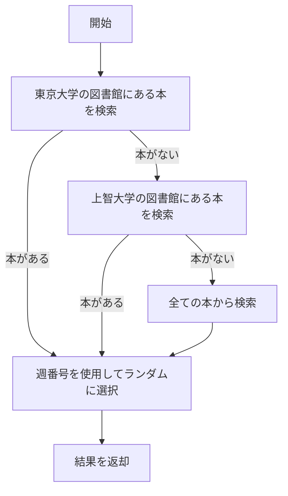
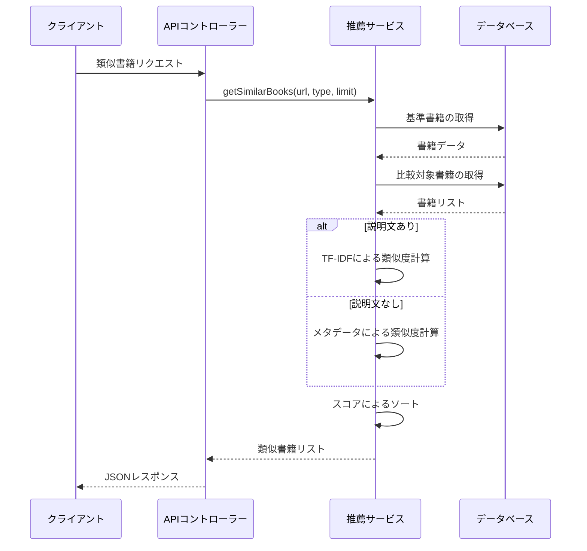

# 推薦エンジンと類似度計算

## 概要

tsundo-cleanerの中核機能の一つは、書籍推薦機能です。このシステムでは、以下の2つの主要な推薦機能を提供しています：

1. **週間おすすめ本**: ユーザーの読みたい本リストから、毎週自動的に1冊を推薦
2. **類似書籍推薦**: 特定の書籍に類似した本を推薦

これらの機能は、バックエンド側の推薦エンジンによって実現されています。本セクションでは、tsundo-cleanerの推薦エンジンの仕組みと実装について詳しく解説します。

## 週間おすすめ本の推薦ロジック

### 優先順位ベースの推薦アルゴリズム

週間おすすめ本は、以下の優先順位に基づいて選択されます：

1. 東京大学の図書館にある本（最優先）
2. 上智大学の図書館にある本（次点）
3. 上記以外の本

この優先順位付けにより、ユーザーがアクセスしやすい本を優先的に推薦します。



### 実装コード

```typescript
// recommendationService.ts - 週間おすすめ本機能
async getWeeklyRecommendation(): Promise<Book> {
  const db = getDatabase();
  try {
    // ランダム性を持たせるために、現在の週番号を使用
    const now = new Date();
    const weekNumber = Math.floor((now.getTime() / (7 * 24 * 60 * 60 * 1000)));
    
    // クエリを実行: UTokyoにある本 → Sophiaにある本 → どちらにもない本の優先順位
    let books = await query<BookDB>(
      db,
      `SELECT * FROM wish 
       WHERE exist_in_UTokyo = 'Yes'
       ORDER BY book_title`
    );
    
    // UTokyoの本がなければSophiaの本を検索
    if (books.length === 0) {
      books = await query<BookDB>(
        db,
        `SELECT * FROM wish 
         WHERE exist_in_Sophia = 'Yes'
         ORDER BY book_title`
      );
    }
    
    // どちらもなければ全ての本から選択
    if (books.length === 0) {
      books = await query<BookDB>(
        db,
        `SELECT * FROM wish 
         ORDER BY book_title`
      );
    }
    
    // 本がない場合はエラー
    if (books.length === 0) {
      throw new Error('推薦する本が見つかりませんでした');
    }
    
    // 週番号を使ってランダムに1冊選択
    const randomIndex = weekNumber % books.length;
    
    // DB形式からアプリケーション形式に変換
    return this.convertToAppModel(books[randomIndex]);
  } catch (err: any) {
    console.error('getWeeklyRecommendationでエラーが発生しました:', err.message);
    throw err;
  }
}
```

### 週番号を使用した疑似ランダム選択

推薦の再現性を確保するために、純粋なランダム選択ではなく、現在の週番号に基づく疑似ランダム選択を実装しています。これにより：

- 同じ週であれば、どのユーザーも同じ本が推薦される
- 週が変わると推薦される本も変わる
- 書籍リストが変わらなければ、特定の周期で同じ本が推薦される

```typescript
// 週番号の計算
const now = new Date();
const weekNumber = Math.floor((now.getTime() / (7 * 24 * 60 * 60 * 1000)));

// 週番号を使ってランダムに1冊選択
const randomIndex = weekNumber % books.length;
```

このような実装により、推薦内容に一定の新鮮さを保ちつつ、推薦結果の予測可能性も確保しています。

## 類似書籍推薦アルゴリズム

類似書籍の推薦には、主に2つの方法を使用しています：

1. **TF-IDF（Term Frequency-Inverse Document Frequency）**: 書籍の説明文を解析し、重要な単語の頻度に基づいて類似度を計算
2. **メタデータ比較**: 説明文がない場合のフォールバック手段として、タイトル、著者、出版社などのメタデータの一致度に基づく類似度計算

### TF-IDFアルゴリズムとは

TF-IDFは、自然言語処理でよく使われるアルゴリズムで、文書内の単語の重要度を数値化します。以下の2つの指標を組み合わせています：

- **TF (Term Frequency)**: ある単語が文書内に出現する頻度
- **IDF (Inverse Document Frequency)**: ある単語が全文書中どれだけ一般的か（逆数）

$$TF(t,d) = \frac{単語tが文書dに出現する回数}{文書dの総単語数}$$

$$IDF(t) = \log\frac{総文書数}{単語tを含む文書の数}$$

$$TF\text{-}IDF(t,d) = TF(t,d) \times IDF(t)$$

TF-IDFスコアが高い単語ほど、その文書において特徴的な単語と言えます。

### Natural.jsライブラリを使用したTF-IDF実装

tsundo-cleanerでは、Node.js向け自然言語処理ライブラリである「Natural」のTF-IDF実装を使用しています。

```typescript
// similarityService.ts - TF-IDFを使用した類似度計算
import { TfIdf } from 'natural';

private findSimilarByDescription(
  referenceBook: Book,
  targetBooks: Book[],
  limit: number
): Book[] {
  // 説明文のない書籍をフィルタリング
  const validTargetBooks = targetBooks.filter(book => 
    book.description && book.description.trim() !== ''
  );
  
  const tfidf = new TfIdf();

  // まず全ての説明文をTF-IDFに追加（基準書籍を最初に）
  tfidf.addDocument(referenceBook.description || '');
  validTargetBooks.forEach(book => {
    tfidf.addDocument(book.description || '');
  });

  // 類似度スコアの計算をバッチ処理で行う
  const terms = this.extractKeyTerms(referenceBook.description || '');
  const similarityScores = validTargetBooks.map((book, index) => {
    const docIndex = index + 1; // +1は基準書籍がインデックス0だから
    
    // 重要な単語のみを使って類似度を計算し、計算量を削減
    let score = 0;
    terms.forEach(term => {
      const similarity = tfidf.tfidf(term, docIndex);
      score += similarity;
    });
    
    return { book, score };
  });

  // スコアの高い順にソートして上位limit件を返す
  return similarityScores
    .sort((a, b) => b.score - a.score)
    .slice(0, limit)
    .map(item => item.book);
}
```

### 重要単語の抽出

計算の効率化のため、基準となる書籍の説明文から重要な単語を抽出し、それらの単語のみをTF-IDF計算に使用しています。

```typescript
/**
 * 文章から重要な単語を抽出する
 */
private extractKeyTerms(text: string, maxTerms: number = 20): string[] {
  // 単語に分割して、短すぎる単語や一般的すぎる単語を除外
  const words = text.toLowerCase()
    .replace(/[^\w\s]/g, '') // 記号を除去
    .split(/\s+/)
    .filter(word => word.length > 2) // 3文字以上の単語のみ
    .filter(word => !['the', 'and', 'for', 'with', 'this', 'that'].includes(word));
  
  // 重複を除去して最大maxTerms件返す
  return [...new Set(words)].slice(0, maxTerms);
}
```

この処理によって、計算量を削減しながらも精度の高い類似度計算を実現しています。

### メタデータベースの類似度計算

書籍の説明文がない場合は、メタデータ（タイトル、著者、出版社など）を使用した類似度計算を行います。

```typescript
/**
 * タイトルと著者を使って類似書籍を見つける（説明文がない場合の代替手段）
 */
private findSimilarByTitleAndAuthor(
  referenceBook: Book,
  targetBooks: Book[],
  limit: number
): Book[] {
  // 簡易的な類似度計算（単語の一致度）
  const similarityScores = targetBooks.map(book => {
    let score = 0;
    
    // タイトルの単語一致を計算
    const refTitle = referenceBook.book_title.toLowerCase();
    const targetTitle = book.book_title.toLowerCase();
    const refTitleWords = refTitle.split(/\s+/);
    const targetTitleWords = targetTitle.split(/\s+/);
    
    // タイトルの単語が一致するごとにスコア加算
    refTitleWords.forEach(word => {
      if (targetTitleWords.includes(word)) {
        score += 3; // タイトル一致は重み付け
      }
    });
    
    // 著者一致でスコア加算
    if (referenceBook.author === book.author) {
      score += 5; // 著者一致は重要
    }
    
    // 出版社一致でスコア加算
    if (referenceBook.publisher === book.publisher) {
      score += 2;
    }
    
    return { book, score };
  });
  
  // スコアの高い順にソートして上位limit件を返す
  return similarityScores
    .sort((a, b) => b.score - a.score)
    .slice(0, limit)
    .map(item => item.book);
}
```

このメソッドでは、各メタデータに以下のような重み付けを行っています：

- **著者の一致**: 最も重要（スコア+5）
- **タイトルの単語一致**: 次に重要（単語ごとにスコア+3）
- **出版社の一致**: 補助的な要素（スコア+2）

これにより、説明文がない場合でも、ある程度直感的な類似度計算が可能になっています。

## 推薦エンジンの最適化

### 1. バッチ処理による効率化

TF-IDFの計算は計算量が多くなる可能性があるため、以下の最適化を行っています：

- 対象書籍の制限: パフォーマンス向上のため、比較対象を100冊に制限
- 重要単語の抽出: 全ての単語ではなく、重要な単語（最大20語）のみを使用
- バッチ処理: 全書籍のTF-IDFを一度に計算

```typescript
// パフォーマンス向上のため上限を設定
const targetDbBooks = await query<BookDB>(
  db,
  `SELECT * FROM ${type} 
   WHERE description IS NOT NULL 
   AND description != '' 
   AND bookmeter_url != ?
   LIMIT 100`,
  [referenceBookUrl]
);

// 一度にすべての文書のTF-IDFを計算
const tfidf = new TfIdf();
tfidf.addDocument(referenceBook.description || '');
validTargetBooks.forEach(book => {
  tfidf.addDocument(book.description || '');
});
```

### 2. フォールバック戦略

説明文がない場合に備えて、メタデータベースの類似度計算をフォールバックとして用意しています。

```typescript
// 説明文がない場合はタイトルと著者で検索
if (!referenceBook.description || referenceBook.description.trim() === '') {
  return this.findSimilarByTitleAndAuthor(referenceBook, targetBooks, limit);
}

// TF-IDFを使った類似度計算
return this.findSimilarByDescription(referenceBook, targetBooks, limit);
```

### 3. フィルタリングとバリデーション

無効なデータや不要な計算を避けるため、事前フィルタリングを行っています：

```typescript
// 説明文のない書籍をフィルタリング
const validTargetBooks = targetBooks.filter(book => 
  book.description && book.description.trim() !== ''
);

if (validTargetBooks.length === 0) {
  return [];
}
```

## 推薦パイプラインの流れ

推薦処理の全体的な流れは以下のとおりです：



## ジャンルベースの推薦機能

一般的な類似書籍推薦とは別に、特定のジャンル（著者や出版社）に基づく推薦機能も実装しています。

```typescript
/**
 * ジャンル（著者/出版社）に基づく推薦
 * 特定の著者や出版社の本をランダムに推薦
 */
async getRecommendationByGenre(
  type: BookType = 'wish',
  genreType: 'author' | 'publisher',
  genreValue: string
): Promise<Book | null> {
  const db = getDatabase();
  try {
    // SQLインジェクション防止のため、typeは許可リストで検証
    if (type !== 'wish' && type !== 'stacked') {
      throw new Error(`無効な書籍タイプ: ${type}`);
    }

    // genreTypeも検証
    if (genreType !== 'author' && genreType !== 'publisher') {
      throw new Error(`無効なジャンルタイプ: ${genreType}`);
    }
    
    // クエリを実行
    const books = await query<BookDB>(
      db,
      `SELECT * FROM ${type} 
       WHERE ${genreType} = ?
       ORDER BY RANDOM()
       LIMIT 1`,
      [genreValue]
    );
    
    if (books.length === 0) {
      return null;
    }
    
    // DB形式からアプリケーション形式に変換
    return this.convertToAppModel(books[0]);
  } catch (err: any) {
    console.error(`getRecommendationByGenre(${type}, ${genreType}, ${genreValue})でエラーが発生しました:`, err.message);
    throw err;
  }
}
```

この機能により、「特定の著者の他の本を読みたい」「特定の出版社の本をもっと知りたい」といったニーズに応えることができます。

## 推薦システムの拡張性

現在の推薦システムは、以下のような方向で拡張可能です：

1. **協調フィルタリング**: 複数ユーザーのデータが利用可能になれば、「この本を読んだ人はこんな本も読んでいます」という推薦も可能
2. **カテゴリベース推薦**: 書籍のカテゴリ・ジャンル情報を活用した推薦
3. **ハイブリッドアプローチ**: 複数の推薦アルゴリズムを組み合わせた推薦
4. **機械学習モデル**: より高度な自然言語処理モデル（Word2Vec、Doc2Vec、BERTなど）の導入

## まとめ

tsundo-cleanerの推薦エンジンは、優先順位ベースの週間推薦と、TF-IDFベースの類似書籍推薦という2つのコア機能を提供しています。これらは単純なアルゴリズムながらも、効率的に実装され、ユーザーに価値のある推薦を行うことができます。

また、拡張性を考慮した設計により、将来的により高度な推薦アルゴリズムの導入も容易です。例えば、協調フィルタリングやより高度な自然言語処理モデルの統合なども検討できます。

次のセクションでは、可視化機能とデータ分析について詳細に解説します。
