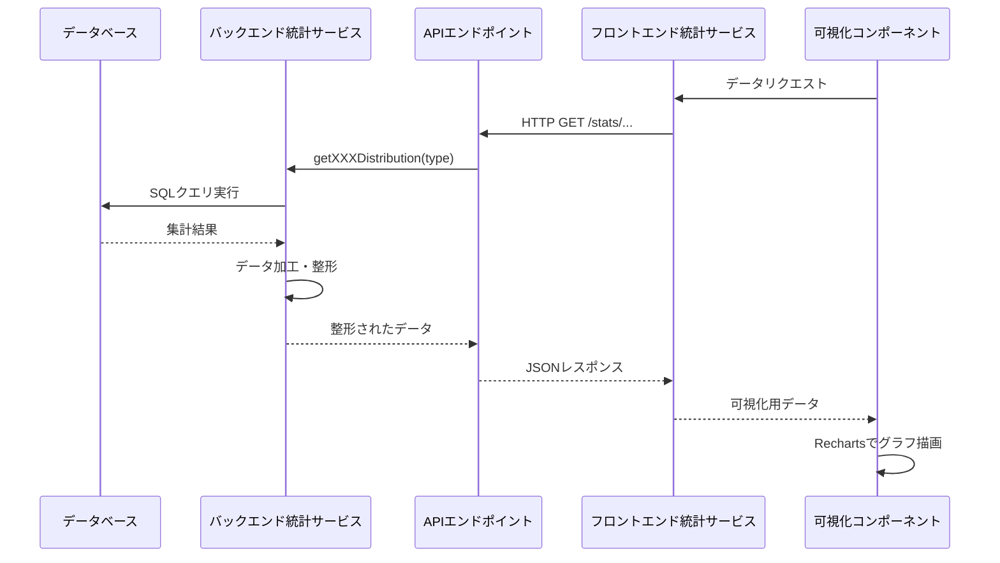

# 可視化機能とデータ分析

## 概要

tsundo-cleanerでは、ユーザーの読書傾向を分析し、視覚的に表示するための機能を提供しています。これにより、ユーザーは自分の興味や傾向を客観的に把握することができます。このセクションでは、データの収集、分析、および可視化の方法について解説します。

## 統計情報の種類

tsundo-cleanerでは、以下の4つの主要な統計情報を提供しています：

1. **出版社別分布**: どの出版社の本を多く読んでいるか
2. **著者別分布**: どの著者の本を多く読んでいるか
3. **出版年別分布**: どの年代の本を多く読んでいるか
4. **図書館所蔵状況**: 読みたい本や積読本が大学図書館でどの程度利用可能か

これらの統計情報は、「読みたい本リスト」と「積読リスト」の両方に対して提供されます。

## バックエンド実装：統計データの収集と集計

### 統計サービスの基本構造

```typescript
// statisticsService.ts - 統計サービスの基本構造
import { getDatabase, query } from '../config/database';

export class StatisticsService {
  /**
   * 出版社別の分布を取得
   */
  async getPublisherDistribution(type: 'wish' | 'stacked' = 'wish'): Promise<{ name: string, value: number }[]> {
    const db = getDatabase();
    try {
      // テーブル名のバリデーション
      if (type !== 'wish' && type !== 'stacked') {
        throw new Error(`無効な書籍タイプ: ${type}`);
      }
      
      // SQLクエリで出版社別の集計を実行
      const results = await query<{ name: string, value: number }>(
        db,
        `SELECT publisher as name, COUNT(*) as value 
         FROM ${type} 
         GROUP BY publisher 
         ORDER BY value DESC 
         LIMIT 10`
      );
      
      return results;
    } catch (err: any) {
      console.error(`getPublisherDistribution(${type})でエラーが発生しました:`, err.message);
      throw err;
    }
  }
  
  // 他の統計メソッド...
}
```

### 著者別分布

```typescript
/**
 * 著者別の分布を取得
 */
async getAuthorDistribution(type: 'wish' | 'stacked' = 'wish'): Promise<{ name: string, value: number }[]> {
  const db = getDatabase();
  try {
    // テーブル名のバリデーション
    if (type !== 'wish' && type !== 'stacked') {
      throw new Error(`無効な書籍タイプ: ${type}`);
    }
    
    // SQLクエリで著者別の集計を実行
    const results = await query<{ name: string, value: number }>(
      db,
      `SELECT author as name, COUNT(*) as value 
       FROM ${type} 
       GROUP BY author 
       ORDER BY value DESC 
       LIMIT 10`
    );
    
    return results;
  } catch (err: any) {
    console.error(`getAuthorDistribution(${type})でエラーが発生しました:`, err.message);
    throw err;
  }
}
```

### 出版年別分布

出版年の分析では、年代ごとのグループ化を行っています：

```typescript
/**
 * 出版年別の分布を取得
 */
async getYearDistribution(type: 'wish' | 'stacked' = 'wish'): Promise<{ name: string, value: number }[]> {
  const db = getDatabase();
  try {
    // テーブル名のバリデーション
    if (type !== 'wish' && type !== 'stacked') {
      throw new Error(`無効な書籍タイプ: ${type}`);
    }
    
    // 出版日から年を抽出して集計
    const rawResults = await query<{ year: string, count: number }>(
      db,
      `SELECT substr(published_date, 1, 4) as year, COUNT(*) as count 
       FROM ${type} 
       WHERE published_date IS NOT NULL AND published_date != ''
       GROUP BY year 
       ORDER BY year`
    );
    
    // 結果を整形（年代ごとにグループ化）
    const yearGroups: { [key: string]: number } = {};
    
    rawResults.forEach(item => {
      const year = parseInt(item.year, 10);
      if (!isNaN(year)) {
        // 10年単位でグループ化
        const decade = Math.floor(year / 10) * 10;
        const decadeKey = `${decade}年代`;
        
        if (yearGroups[decadeKey]) {
          yearGroups[decadeKey] += item.count;
        } else {
          yearGroups[decadeKey] = item.count;
        }
      }
    });
    
    // 結果を配列に変換
    const formattedResults = Object.entries(yearGroups)
      .map(([name, value]) => ({ name, value }))
      .sort((a, b) => {
        // 年代順にソート
        const decadeA = parseInt(a.name, 10);
        const decadeB = parseInt(b.name, 10);
        return decadeA - decadeB;
      });
    
    return formattedResults;
  } catch (err: any) {
    console.error(`getYearDistribution(${type})でエラーが発生しました:`, err.message);
    throw err;
  }
}
```

### 図書館所蔵状況の分析

ユーザーの書籍リストに対して、各図書館がどの程度の割合で所蔵しているかを分析します：

```typescript
/**
 * 図書館所蔵状況の分布を取得
 */
async getLibraryDistribution(type: 'wish' | 'stacked' = 'wish'): Promise<{ name: string, value: number, percentage: number }[]> {
  const db = getDatabase();
  try {
    // テーブル名のバリデーション
    if (type !== 'wish' && type !== 'stacked') {
      throw new Error(`無効な書籍タイプ: ${type}`);
    }
    
    // 総書籍数を取得
    const totalResult = await query<{ total: number }>(
      db,
      `SELECT COUNT(*) as total FROM ${type}`
    );
    const total = totalResult[0].total;
    
    if (total === 0) {
      return [];
    }
    
    // 各図書館の所蔵数を取得
    const utokyo = await query<{ count: number }>(
      db,
      `SELECT COUNT(*) as count FROM ${type} WHERE exist_in_UTokyo = 'Yes'`
    );
    
    const sophia = await query<{ count: number }>(
      db,
      `SELECT COUNT(*) as count FROM ${type} WHERE exist_in_Sophia = 'Yes'`
    );
    
    // 結果を整形
    const results = [
      { 
        name: '東京大学', 
        value: utokyo[0].count,
        percentage: Math.round((utokyo[0].count / total) * 100) 
      },
      { 
        name: '上智大学', 
        value: sophia[0].count,
        percentage: Math.round((sophia[0].count / total) * 100)
      },
      { 
        name: 'どちらもなし', 
        value: total - utokyo[0].count - sophia[0].count,
        percentage: Math.round(((total - utokyo[0].count - sophia[0].count) / total) * 100)
      }
    ];
    
    return results;
  } catch (err: any) {
    console.error(`getLibraryDistribution(${type})でエラーが発生しました:`, err.message);
    throw err;
  }
}
```

## バックエンドAPI：統計データの提供

統計サービスは、コントローラーを通じてRESTful APIとして公開されています：

```typescript
// statisticsController.ts - 統計コントローラー
import { Request, Response } from 'express';
import { StatisticsService } from '../services/statisticsService';

export class StatisticsController {
  private statisticsService: StatisticsService;

  constructor() {
    this.statisticsService = new StatisticsService();
  }

  /**
   * 出版社別分布を取得するエンドポイント
   */
  getPublisherDistribution = async (req: Request, res: Response): Promise<void> => {
    try {
      const type = (req.query.type as 'wish' | 'stacked') || 'wish';
      const distribution = await this.statisticsService.getPublisherDistribution(type);
      res.json(distribution);
    } catch (err: any) {
      res.status(500).json({ error: err.message });
    }
  };

  /**
   * 著者別分布を取得するエンドポイント
   */
  getAuthorDistribution = async (req: Request, res: Response): Promise<void> => {
    try {
      const type = (req.query.type as 'wish' | 'stacked') || 'wish';
      const distribution = await this.statisticsService.getAuthorDistribution(type);
      res.json(distribution);
    } catch (err: any) {
      res.status(500).json({ error: err.message });
    }
  };

  // 他のエンドポイント...
}
```

## フロントエンド実装：データ可視化

### Rechartsライブラリの活用

tsundo-cleanerでは、データ可視化にRechartsライブラリを使用しています。Rechartsは、ReactとD3.jsをベースにしたグラフ作成ライブラリで、以下の特徴があります：

- Reactコンポーネントとしてシームレスに統合
- 宣言的なAPIでグラフを簡単に定義
- レスポンシブデザインに対応
- 豊富なカスタマイズオプション

### 統計APIサービス

フロントエンドでは、バックエンドAPIにアクセスするための専用サービスを定義しています：

```typescript
// statisticsService.ts - フロントエンド統計APIサービス
import apiClient from './api';

export const statisticsService = {
  /**
   * 出版社別分布を取得
   */
  async getPublisherDistribution(type: 'wish' | 'stacked' = 'wish'): Promise<any[]> {
    const response = await apiClient.get('/stats/publishers', {
      params: { type }
    });
    return response.data;
  },

  /**
   * 著者別分布を取得
   */
  async getAuthorDistribution(type: 'wish' | 'stacked' = 'wish'): Promise<any[]> {
    const response = await apiClient.get('/stats/authors', {
      params: { type }
    });
    return response.data;
  },

  /**
   * 出版年別分布を取得
   */
  async getYearDistribution(type: 'wish' | 'stacked' = 'wish'): Promise<any[]> {
    const response = await apiClient.get('/stats/years', {
      params: { type }
    });
    return response.data;
  },

  /**
   * 図書館所蔵状況の分布を取得
   */
  async getLibraryDistribution(type: 'wish' | 'stacked' = 'wish'): Promise<any[]> {
    const response = await apiClient.get('/stats/libraries', {
      params: { type }
    });
    return response.data;
  }
};
```

### 統計ページコンポーネント

統計情報を表示するためのページコンポーネントを実装しています：

```tsx
// StatsPage.tsx - 統計ページコンポーネント
import React, { useState, useEffect } from 'react';
import styled from 'styled-components';
import Layout from '../components/Layout';
import { statisticsService } from '../services/statisticsService';
import PublisherChart from '../components/charts/PublisherChart';
import AuthorChart from '../components/charts/AuthorChart';
import YearChart from '../components/charts/YearChart';
import LibraryChart from '../components/charts/LibraryChart';

const StatsPage: React.FC = () => {
  const [bookType, setBookType] = useState<'wish' | 'stacked'>('wish');
  const [loading, setLoading] = useState<boolean>(false);

  // ブックタイプの切り替え
  const handleTypeChange = (event: React.ChangeEvent<HTMLSelectElement>) => {
    setBookType(event.target.value as 'wish' | 'stacked');
  };

  return (
    <Layout>
      <PageContainer>
        <PageHeader>
          <PageTitle>読書傾向分析</PageTitle>
          <TypeSelector>
            <label htmlFor="bookType">データソース:</label>
            <Select id="bookType" value={bookType} onChange={handleTypeChange}>
              <option value="wish">読みたい本リスト</option>
              <option value="stacked">積読リスト</option>
            </Select>
          </TypeSelector>
        </PageHeader>

        <Description>
          あなたの読書リストを分析した結果です。興味のある出版社、著者、年代などの傾向を確認できます。
        </Description>

        <ChartSection>
          <SectionTitle>出版社別分布</SectionTitle>
          <PublisherChart type={bookType} />
        </ChartSection>

        <ChartSection>
          <SectionTitle>著者別分布</SectionTitle>
          <AuthorChart type={bookType} />
        </ChartSection>

        <ChartSection>
          <SectionTitle>出版年別分布</SectionTitle>
          <YearChart type={bookType} />
        </ChartSection>

        <ChartSection>
          <SectionTitle>図書館所蔵状況</SectionTitle>
          <LibraryChart type={bookType} />
        </ChartSection>
      </PageContainer>
    </Layout>
  );
};

// スタイルコンポーネント定義...

export default StatsPage;
```

### グラフコンポーネント

各種グラフを表示するための再利用可能なコンポーネントを実装しています。以下は出版社別分布を表示する棒グラフの例です：

```tsx
// PublisherChart.tsx - 出版社別分布グラフコンポーネント
import React, { useState, useEffect } from 'react';
import styled from 'styled-components';
import { BarChart, Bar, XAxis, YAxis, CartesianGrid, Tooltip, Legend, ResponsiveContainer } from 'recharts';
import { statisticsService } from '../../services/statisticsService';

interface PublisherChartProps {
  type: 'wish' | 'stacked';
}

const PublisherChart: React.FC<PublisherChartProps> = ({ type }) => {
  const [data, setData] = useState<any[]>([]);
  const [loading, setLoading] = useState<boolean>(true);
  const [error, setError] = useState<string | null>(null);

  useEffect(() => {
    const fetchData = async () => {
      try {
        setLoading(true);
        const chartData = await statisticsService.getPublisherDistribution(type);
        setData(chartData);
        setError(null);
      } catch (err) {
        console.error('出版社分布の取得に失敗しました', err);
        setError('データの取得に失敗しました。後ほど再度お試しください。');
      } finally {
        setLoading(false);
      }
    };

    fetchData();
  }, [type]);

  if (loading) {
    return <Loading>読み込み中...</Loading>;
  }

  if (error) {
    return <Error>{error}</Error>;
  }

  if (data.length === 0) {
    return <NoData>データがありません</NoData>;
  }

  return (
    <ChartContainer>
      <ResponsiveContainer width="100%" height={400}>
        <BarChart
          data={data}
          margin={{ top: 20, right: 30, left: 20, bottom: 70 }}
        >
          <CartesianGrid strokeDasharray="3 3" />
          <XAxis 
            dataKey="name" 
            angle={-45} 
            textAnchor="end"
            height={80}
            interval={0}
          />
          <YAxis />
          <Tooltip formatter={(value) => [`${value}冊`, '書籍数']} />
          <Legend />
          <Bar dataKey="value" name="書籍数" fill="#8884d8" />
        </BarChart>
      </ResponsiveContainer>
    </ChartContainer>
  );
};

// スタイルコンポーネント定義...

export default PublisherChart;
```

### 円グラフの実装

図書館所蔵状況など、割合を示すのに適したデータには円グラフを使用しています：

```tsx
// LibraryChart.tsx - 図書館所蔵状況グラフコンポーネント
import React, { useState, useEffect } from 'react';
import styled from 'styled-components';
import { PieChart, Pie, Cell, Tooltip, Legend, ResponsiveContainer } from 'recharts';
import { statisticsService } from '../../services/statisticsService';

interface LibraryChartProps {
  type: 'wish' | 'stacked';
}

const COLORS = ['#0088FE', '#00C49F', '#FFBB28'];

const LibraryChart: React.FC<LibraryChartProps> = ({ type }) => {
  const [data, setData] = useState<any[]>([]);
  const [loading, setLoading] = useState<boolean>(true);
  const [error, setError] = useState<string | null>(null);

  useEffect(() => {
    const fetchData = async () => {
      try {
        setLoading(true);
        const chartData = await statisticsService.getLibraryDistribution(type);
        setData(chartData);
        setError(null);
      } catch (err) {
        console.error('図書館所蔵状況の取得に失敗しました', err);
        setError('データの取得に失敗しました。後ほど再度お試しください。');
      } finally {
        setLoading(false);
      }
    };

    fetchData();
  }, [type]);

  if (loading) {
    return <Loading>読み込み中...</Loading>;
  }

  if (error) {
    return <Error>{error}</Error>;
  }

  if (data.length === 0) {
    return <NoData>データがありません</NoData>;
  }

  // カスタムツールチップ
  const customTooltip = ({ active, payload }: any) => {
    if (active && payload && payload.length) {
      const item = payload[0].payload;
      return (
        <TooltipContainer>
          <p className="name">{item.name}</p>
          <p className="value">{item.value}冊（{item.percentage}%）</p>
        </TooltipContainer>
      );
    }
    return null;
  };

  return (
    <ChartContainer>
      <ResponsiveContainer width="100%" height={400}>
        <PieChart>
          <Pie
            data={data}
            cx="50%"
            cy="50%"
            labelLine={false}
            outerRadius={150}
            fill="#8884d8"
            dataKey="value"
            nameKey="name"
            label={({ name, percent }) => `${name} ${(percent * 100).toFixed(0)}%`}
          >
            {data.map((entry, index) => (
              <Cell key={`cell-${index}`} fill={COLORS[index % COLORS.length]} />
            ))}
          </Pie>
          <Tooltip content={customTooltip} />
          <Legend />
        </PieChart>
      </ResponsiveContainer>
    </ChartContainer>
  );
};

// スタイルコンポーネント定義...

export default LibraryChart;
```

## 時系列データの可視化

出版年別分布には、時系列データをより明確に表現するための折れ線グラフを使用しています：

```tsx
// YearChart.tsx - 出版年別分布グラフコンポーネント
import React, { useState, useEffect } from 'react';
import styled from 'styled-components';
import { LineChart, Line, XAxis, YAxis, CartesianGrid, Tooltip, Legend, ResponsiveContainer } from 'recharts';
import { statisticsService } from '../../services/statisticsService';

interface YearChartProps {
  type: 'wish' | 'stacked';
}

const YearChart: React.FC<YearChartProps> = ({ type }) => {
  const [data, setData] = useState<any[]>([]);
  const [loading, setLoading] = useState<boolean>(true);
  const [error, setError] = useState<string | null>(null);

  useEffect(() => {
    const fetchData = async () => {
      try {
        setLoading(true);
        const chartData = await statisticsService.getYearDistribution(type);
        setData(chartData);
        setError(null);
      } catch (err) {
        console.error('出版年分布の取得に失敗しました', err);
        setError('データの取得に失敗しました。後ほど再度お試しください。');
      } finally {
        setLoading(false);
      }
    };

    fetchData();
  }, [type]);

  if (loading) {
    return <Loading>読み込み中...</Loading>;
  }

  if (error) {
    return <Error>{error}</Error>;
  }

  if (data.length === 0) {
    return <NoData>データがありません</NoData>;
  }

  return (
    <ChartContainer>
      <ResponsiveContainer width="100%" height={400}>
        <LineChart
          data={data}
          margin={{ top: 20, right: 30, left: 20, bottom: 10 }}
        >
          <CartesianGrid strokeDasharray="3 3" />
          <XAxis dataKey="name" />
          <YAxis />
          <Tooltip formatter={(value) => [`${value}冊`, '書籍数']} />
          <Legend />
          <Line 
            type="monotone" 
            dataKey="value" 
            name="書籍数" 
            stroke="#8884d8" 
            activeDot={{ r: 8 }} 
          />
        </LineChart>
      </ResponsiveContainer>
    </ChartContainer>
  );
};

// スタイルコンポーネント定義...

export default YearChart;
```

## データフローの全体像

統計データの収集から表示までの全体的なデータフローは以下のとおりです：



## パフォーマンス最適化

### 1. データ集計のSQL最適化

統計データの収集では、効率的なSQLクエリを使用してデータベース側で集計処理を行っています：

```sql
-- 出版社別集計の例
SELECT publisher as name, COUNT(*) as value 
FROM wish 
GROUP BY publisher 
ORDER BY value DESC 
LIMIT 10
```

このように、SQLの集約関数を使ってデータベース側で集計を行うことで、アプリケーションへのデータ転送量を削減し、処理を高速化しています。

### 2. 適切なレスポンスキャッシュ

頻繁に変更されない統計データに対して、フロントエンドでのキャッシュを実装することで、不要なAPIリクエストを削減します：

```typescript
// キャッシュを活用した統計サービスの例
// cache.ts
export const statsCache = {
  publishers: new Map<string, { data: any[], timestamp: number }>(),
  authors: new Map<string, { data: any[], timestamp: number }>(),
  years: new Map<string, { data: any[], timestamp: number }>(),
  libraries: new Map<string, { data: any[], timestamp: number }>(),
};

// statisticsService.ts
import { statsCache } from './cache';

export const statisticsService = {
  async getPublisherDistribution(type: 'wish' | 'stacked' = 'wish'): Promise<any[]> {
    // キャッシュの確認（1時間以内のデータはキャッシュから返す）
    const cache = statsCache.publishers.get(type);
    const now = Date.now();
    if (cache && (now - cache.timestamp < 60 * 60 * 1000)) {
      return cache.data;
    }
    
    // キャッシュがない場合はAPIから取得
    const response = await apiClient.get('/stats/publishers', {
      params: { type }
    });
    
    // キャッシュを更新
    statsCache.publishers.set(type, { 
      data: response.data, 
      timestamp: now 
    });
    
    return response.data;
  },
  
  // 他のメソッド...
};
```

### 3. レスポンシブなグラフ表示

Rechartsの`ResponsiveContainer`を使用して、さまざまな画面サイズに対応するレスポンシブなグラフを実現しています：

```tsx
<ResponsiveContainer width="100%" height={400}>
  <BarChart data={data} margin={{ top: 20, right: 30, left: 20, bottom: 70 }}>
    {/* グラフの内容 */}
  </BarChart>
</ResponsiveContainer>
```

### 4. 遅延読み込み

統計ページ全体ではなく、各グラフコンポーネントが個別にデータを読み込むようにすることで、初期表示を高速化しています：

```tsx
// StatsPage.tsx - 個別読み込みの例
<ChartSection>
  <SectionTitle>出版社別分布</SectionTitle>
  <PublisherChart type={bookType} />
</ChartSection>

<ChartSection>
  <SectionTitle>著者別分布</SectionTitle>
  <AuthorChart type={bookType} />
</ChartSection>
```

各グラフコンポーネントは独立してAPIリクエストを実行するため、一部のデータの読み込みが遅延しても、他のグラフは表示できます。

## まとめ

tsundo-cleanerの可視化機能は、バックエンドでの効率的なデータ集計とフロントエンドでのRechartsを使用した視覚的表現により、ユーザーの読書傾向を分かりやすく提示することができます。

データフローの各段階で最適化を行うことで、パフォーマンスと使いやすさを両立させています。また、コンポーネントベースの設計により、新しいタイプの統計情報やグラフを追加する際の拡張性も確保されています。

次のセクションでは、アプリケーション全体のデータモデリングとデータアクセスについて詳細に解説します。
